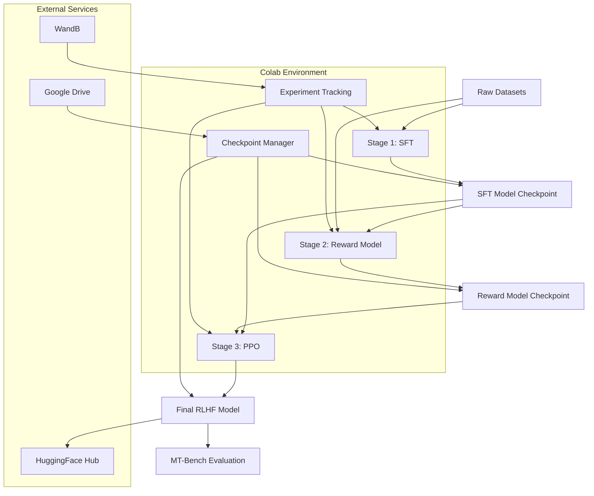

# Design Document: RLHF Phi-3 Pipeline

## Overview

This document outlines the design for a complete, production-grade Reinforcement Learning from Human Feedback (RLHF) pipeline for Microsoft Phi-3 Mini (3.8B parameters). The system implements a three-stage training process: Supervised Fine-Tuning (SFT), Reward Model Training, and Proximal Policy Optimization (PPO). The pipeline is designed for Google Colab's free tier with T4 GPU constraints, featuring modular architecture, checkpoint persistence via Google Drive, and HuggingFace Hub integration for model publishing.

The pipeline serves as both a learning tool for ML engineers new to training pipelines and a production-ready system suitable for portfolio demonstration. It emphasizes memory efficiency through PEFT/LoRA techniques, proper experiment tracking, and comprehensive evaluation capabilities.

## Architecture



## Components and Interfaces

### Component 1: Configuration Manager

**Purpose**: Centralized configuration management for all hyperparameters, paths, and environment settings

**Interface**:
```python
class Config:
    # Model Configuration
    model_name: str = "microsoft/Phi-3-mini-4k-instruct"
    max_length: int = 2048
    
    # Training Configuration
    sft_epochs: int = 3
    reward_epochs: int = 1
    ppo_steps: int = 1000
    
    # LoRA Configuration
    lora_r: int = 16
    lora_alpha: int = 32
    lora_dropout: float = 0.1
    
    # Paths and Storage
    base_output_dir: str = "/content/drive/MyDrive/rlhf-phi3"
    wandb_project: str = "rlhf-phi3-pipeline"
    
    def get_stage_config(self, stage: str) -> Dict[str, Any]
    def validate_config(self) -> bool
    def save_config(self, path: str) -> None
```

**Responsibilities**:
- Maintain all hyperparameters in a single location
- Provide stage-specific configuration subsets
- Validate configuration consistency
- Support configuration serialization for reproducibility

### Component 2: Dataset Manager

**Purpose**: Handle dataset loading, preprocessing, and formatting for each training stage

**Interface**:
```python
class DatasetManager:
    def load_sft_dataset(self, dataset_name: str) -> Dataset
    def load_preference_dataset(self, dataset_name: str) -> Dataset
    def preprocess_sft_data(self, dataset: Dataset) -> Dataset
    def preprocess_preference_data(self, dataset: Dataset) -> Dataset
    def create_dataloaders(self, dataset: Dataset, batch_size: int) -> DataLoader
    def format_chat_template(self, messages: List[Dict]) -> str
```

**Responsibilities**:
- Load datasets from HuggingFace Hub or local sources
- Apply consistent preprocessing and tokenization
- Format data according to Phi-3's chat template
- Create memory-efficient data loaders
- Handle dataset caching and validation

### Component 3: Model Manager

**Purpose**: Manage model loading, PEFT configuration, and checkpoint operations

**Interface**:
```python
class ModelManager:
    def load_base_model(self, model_name: str) -> AutoModelForCausalLM
    def setup_peft_config(self, task_type: str) -> LoraConfig
    def apply_peft(self, model: AutoModelForCausalLM, config: LoraConfig) -> PeftModel
    def save_checkpoint(self, model: PeftModel, path: str) -> None
    def load_checkpoint(self, path: str) -> PeftModel
    def merge_and_save(self, model: PeftModel, output_path: str) -> None
    def prepare_for_training(self, model: PeftModel) -> PeftModel
```

**Responsibilities**:
- Handle model loading with proper device placement
- Configure and apply PEFT/LoRA adapters
- Manage checkpoint saving and loading
- Optimize models for training (gradient checkpointing, etc.)
- Support model merging for final deployment

### Component 4: Training Orchestrator

**Purpose**: Coordinate the three-stage training process with proper sequencing and error handling

**Interface**:
```python
class TrainingOrchestrator:
    def __init__(self, config: Config)
    
    def run_sft_stage(self) -> str  # Returns checkpoint path
    def run_reward_stage(self, sft_checkpoint: str) -> str
    def run_ppo_stage(self, sft_checkpoint: str, reward_checkpoint: str) -> str
    def run_full_pipeline(self) -> str
    def resume_from_stage(self, stage: str, checkpoint_path: str) -> str
    def validate_stage_completion(self, stage: str) -> bool
```

**Responsibilities**:
- Orchestrate the complete RLHF pipeline
- Handle stage transitions and dependency management
- Provide resume capabilities for interrupted training
- Validate successful completion of each stage
- Coordinate with checkpoint and experiment tracking systems

### Component 5: Checkpoint Manager

**Purpose**: Handle persistent storage of model checkpoints and training state via Google Drive

**Interface**:
```python
class CheckpointManager:
    def __init__(self, base_path: str)
    
    def save_checkpoint(self, model: PeftModel, optimizer: Optimizer, 
                       epoch: int, stage: str) -> str
    def load_checkpoint(self, checkpoint_path: str) -> Tuple[PeftModel, Optimizer, int]
    def list_checkpoints(self, stage: str) -> List[str]
    def cleanup_old_checkpoints(self, keep_last: int = 3) -> None
    def sync_to_drive(self) -> bool
    def get_latest_checkpoint(self, stage: str) -> Optional[str]
```

**Responsibilities**:
- Persist model and optimizer states to Google Drive
- Enable training resumption across Colab sessions
- Manage checkpoint versioning and cleanup
- Handle Google Drive authentication and synchronization
- Provide checkpoint discovery and validation

### Component 6: Experiment Tracker

**Purpose**: Integrate with Weights & Biases for comprehensive experiment tracking and visualization

**Interface**:
```python
class ExperimentTracker:
    def __init__(self, project_name: str, config: Config)
    
    def start_run(self, stage: str, run_name: str) -> None
    def log_metrics(self, metrics: Dict[str, float], step: int) -> None
    def log_model_checkpoint(self, checkpoint_path: str, stage: str) -> None
    def log_evaluation_results(self, results: Dict[str, Any]) -> None
    def finish_run(self) -> None
    def create_training_plots(self, metrics_history: List[Dict]) -> None
```

**Responsibilities**:
- Track training metrics across all stages
- Log hyperparameters and configuration
- Store model artifacts and checkpoints
- Generate training visualization plots
- Enable experiment comparison and analysis

### Component 7: Evaluation Engine

**Purpose**: Provide comprehensive model evaluation using MT-Bench style assessments

**Interface**:
```python
class EvaluationEngine:
    def __init__(self, model_path: str, config: Config)
    
    def run_mt_bench_evaluation(self) -> Dict[str, float]
    def evaluate_response_quality(self, prompts: List[str]) -> Dict[str, Any]
    def compare_models(self, baseline_path: str, improved_path: str) -> Dict[str, Any]
    def generate_evaluation_report(self, results: Dict[str, Any]) -> str
    def benchmark_inference_speed(self) -> Dict[str, float]
```

**Responsibilities**:
- Implement MT-Bench evaluation protocol
- Assess response quality and helpfulness
- Compare model performance across training stages
- Generate comprehensive evaluation reports
- Measure inference performance metrics

## Data Models

### Training Configuration Model

```python
@dataclass
class TrainingConfig:
    # Model Configuration
    model_name: str
    max_length: int
    device: str
    
    # LoRA Configuration
    lora_config: LoraConfig
    
    # Training Hyperparameters
    learning_rate: float
    batch_size: int
    gradient_accumulation_steps: int
    warmup_steps: int
    max_steps: int
    
    # Optimization Settings
    optimizer_type: str
    scheduler_type: str
    weight_decay: float
    max_grad_norm: float
    
    # Logging and Checkpointing
    logging_steps: int
    save_steps: int
    eval_steps: int
    
    def validate(self) -> List[str]  # Returns validation errors
```

**Validation Rules**:
- learning_rate must be between 1e-6 and 1e-2
- batch_size must be power of 2 and fit in GPU memory
- max_length must not exceed model's context window
- lora_r must be positive integer less than model dimension

### Dataset Schema Model

```python
@dataclass
class SFTDataPoint:
    messages: List[Dict[str, str]]  # Chat format with role/content
    input_ids: List[int]
    attention_mask: List[int]
    labels: List[int]
    
    def validate(self) -> bool
    def format_for_training(self) -> Dict[str, torch.Tensor]

@dataclass
class PreferenceDataPoint:
    prompt: str
    chosen_response: str
    rejected_response: str
    chosen_ids: List[int]
    rejected_ids: List[int]
    
    def validate(self) -> bool
    def format_for_reward_training(self) -> Dict[str, torch.Tensor]
```

**Validation Rules**:
- messages must contain at least one user message
- input_ids length must not exceed max_length
- chosen_response and rejected_response must be different
- All text fields must be non-empty strings

### Checkpoint Metadata Model

```python
@dataclass
class CheckpointMetadata:
    stage: str  # "sft", "reward", or "ppo"
    epoch: int
    step: int
    timestamp: datetime
    model_path: str
    optimizer_path: str
    config_hash: str
    metrics: Dict[str, float]
    
    def save_metadata(self, path: str) -> None
    def load_metadata(self, path: str) -> 'CheckpointMetadata'
    def validate_integrity(self) -> bool
```

**Validation Rules**:
- stage must be one of ["sft", "reward", "ppo"]
- epoch and step must be non-negative integers
- model_path and optimizer_path must exist
- config_hash must match current configuration

### Evaluation Results Model

```python
@dataclass
class EvaluationResults:
    model_name: str
    evaluation_type: str  # "mt_bench", "quality", "speed"
    timestamp: datetime
    
    # MT-Bench Scores
    mt_bench_score: Optional[float]
    category_scores: Optional[Dict[str, float]]
    
    # Quality Metrics
    helpfulness_score: Optional[float]
    harmlessness_score: Optional[float]
    honesty_score: Optional[float]
    
    # Performance Metrics
    tokens_per_second: Optional[float]
    memory_usage_mb: Optional[float]
    
    # Detailed Results
    sample_responses: List[Dict[str, str]]
    
    def generate_report(self) -> str
    def compare_with_baseline(self, baseline: 'EvaluationResults') -> Dict[str, float]
```

**Validation Rules**:
- All score fields must be between 0.0 and 10.0 if present
- tokens_per_second must be positive if present
- sample_responses must contain at least 5 examples
- evaluation_type must be from predefined list

## Error Handling

### Error Scenario 1: GPU Memory Exhaustion

**Condition**: When batch size or model size exceeds available GPU memory
**Response**: Automatically reduce batch size and increase gradient accumulation steps
**Recovery**: Implement dynamic batch size adjustment with memory monitoring

### Error Scenario 2: Colab Session Timeout

**Condition**: When 12-hour Colab session limit is reached during training
**Response**: Save checkpoint immediately and provide resume instructions
**Recovery**: Automatic checkpoint detection and training resumption on restart

### Error Scenario 3: Google Drive Authentication Failure

**Condition**: When Google Drive mounting or authentication fails
**Response**: Fall back to local storage with warning about session persistence
**Recovery**: Retry authentication with user guidance and manual backup options

### Error Scenario 4: Dataset Loading Failure

**Condition**: When HuggingFace datasets are unavailable or corrupted
**Response**: Attempt alternative dataset sources or use cached versions
**Recovery**: Provide dataset validation and manual download instructions

### Error Scenario 5: Model Convergence Issues

**Condition**: When training loss plateaus or diverges unexpectedly
**Response**: Implement early stopping and learning rate adjustment
**Recovery**: Provide diagnostic tools and hyperparameter tuning suggestions

## Testing Strategy

### Unit Testing Approach

Each component will have comprehensive unit tests covering:
- Configuration validation and serialization
- Dataset loading and preprocessing correctness
- Model loading and PEFT application
- Checkpoint saving and loading integrity
- Evaluation metric calculations

Test coverage goals: >90% for core components, >80% for integration points.

### Property-Based Testing Approach

**Property Test Library**: Hypothesis (Python)

Key properties to test:
- Dataset preprocessing maintains data integrity
- Model outputs are deterministic given same inputs and random seed
- Checkpoint save/load operations preserve model state exactly
- Training metrics are monotonic where expected (e.g., reward model accuracy)
- Memory usage stays within GPU constraints across different configurations

### Integration Testing Approach

End-to-end pipeline tests using minimal datasets:
- Complete SFT stage with toy dataset (100 samples)
- Reward model training with preference pairs (50 pairs)
- PPO training with reduced steps (10 steps)
- Checkpoint persistence across simulated session restarts
- HuggingFace Hub upload and download verification

## Performance Considerations

**Memory Optimization**:
- Use PEFT/LoRA to reduce trainable parameters by 99%
- Implement gradient checkpointing to trade compute for memory
- Dynamic batch size adjustment based on available GPU memory
- Mixed precision training (fp16) to halve memory usage

**Training Efficiency**:
- Gradient accumulation to simulate larger batch sizes
- Optimized data loading with prefetching and caching
- Efficient tokenization with padding strategies
- Learning rate scheduling for faster convergence

**Colab-Specific Optimizations**:
- Checkpoint every 100 steps to handle session interruptions
- Compress checkpoints before Google Drive upload
- Use streaming datasets to avoid memory issues with large datasets
- Implement training progress estimation for session planning

## Security Considerations

**Model Safety**:
- Input validation and sanitization for all user prompts
- Content filtering for training datasets
- Evaluation of model outputs for harmful content generation
- Implementation of safety guardrails in the final model

**Data Privacy**:
- Secure handling of training datasets with potential PII
- Encrypted storage of model checkpoints in Google Drive
- Anonymization of evaluation results and logs
- Compliance with data usage policies for public datasets

**Access Control**:
- Secure API key management for HuggingFace and WandB
- Google Drive access scoped to specific directories
- Model versioning and access control on HuggingFace Hub
- Audit logging for model training and deployment activities

## Correctness Properties

*A property is a characteristic or behavior that should hold true across all valid executions of a system—essentially, a formal statement about what the system should do. Properties serve as the bridge between human-readable specifications and machine-verifiable correctness guarantees.*

### Property 1: Failure State Preservation

*For any* training stage failure scenario, the Training_Orchestrator SHALL save the current state and provide clear error diagnostics.

**Validates: Requirement 1.4**

### Property 2: Stage Validation Consistency

*For any* training stage completion state, the Training_Orchestrator SHALL validate successful completion before proceeding to the next stage.

**Validates: Requirement 1.5**

### Property 3: Memory Adaptive Behavior

*For any* GPU memory usage scenario exceeding 90% capacity, the Model_Manager SHALL automatically reduce batch size and increase gradient accumulation steps.

**Validates: Requirement 2.3**

### Property 4: Evaluation Report Generation

*For any* model comparison scenario, the Evaluation_Engine SHALL generate comprehensive evaluation reports comparing baseline and trained models.

**Validates: Requirement 3.3**

### Property 5: State Preservation During Interruption

*For any* training interruption scenario, the Checkpoint_Manager SHALL preserve the exact model state, optimizer state, and training step.

**Validates: Requirement 4.2**

### Property 6: Checkpoint Integrity Verification

*For any* checkpoint data, the Checkpoint_Manager SHALL maintain checkpoint integrity verification using hash validation.

**Validates: Requirement 4.4**

### Property 7: Checkpoint Cleanup Policy

*For any* checkpoint history, the Checkpoint_Manager SHALL automatically clean up old checkpoints, keeping exactly the 3 most recent per stage.

**Validates: Requirement 4.5**

### Property 8: Streaming Dataset Memory Bounds

*For any* dataset size, the Dataset_Manager SHALL use streaming datasets to avoid loading entire datasets into memory, maintaining bounded memory usage.

**Validates: Requirement 5.4**

### Property 9: Memory Monitoring Consistency

*For any* training stage, the Training_Orchestrator SHALL monitor and report peak memory usage.

**Validates: Requirement 5.5**

### Property 10: Configuration Tracking Completeness

*For any* hyperparameter configuration, the Experiment_Tracker SHALL track all hyperparameters and configuration for full reproducibility.

**Validates: Requirement 6.2**

### Property 11: Training Visualization Generation

*For any* training metrics history, the Experiment_Tracker SHALL generate training visualization plots for loss curves and metric trends.

**Validates: Requirement 6.3**

### Property 12: Run Comparison Capability

*For any* combination of training runs and configurations, the Experiment_Tracker SHALL enable comparison between different training runs and configurations.

**Validates: Requirement 6.5**

### Property 13: Chat Template Format Consistency

*For any* input data format, the Dataset_Manager SHALL preprocess data according to Phi-3's chat template format.

**Validates: Requirement 7.2**

### Property 14: Dataset Validation Accuracy

*For any* dataset format (valid or invalid), the Dataset_Manager SHALL validate dataset integrity and format compliance before training.

**Validates: Requirement 7.3**

### Property 15: Tokenization Strategy Consistency

*For any* text length, the Dataset_Manager SHALL handle tokenization with proper padding and truncation strategies.

**Validates: Requirement 7.4**

### Property 16: Multi-Dataset Type Support

*For any* instruction-following or preference dataset, the Dataset_Manager SHALL support both dataset types correctly.

**Validates: Requirement 7.5**

### Property 17: Configuration Serialization Round-Trip

*For any* hyperparameter combination, the Configuration_Manager SHALL maintain serializable configuration objects with perfect round-trip preservation.

**Validates: Requirements 8.1, 8.4**

### Property 18: Configuration Validation Accuracy

*For any* parameter combination (valid or invalid), the Configuration_Manager SHALL validate configuration consistency and flag invalid parameter combinations.

**Validates: Requirement 8.2**

### Property 19: Stage Configuration Subsetting

*For any* full configuration, the Configuration_Manager SHALL provide stage-specific configuration subsets containing exactly the correct parameters for modular training.

**Validates: Requirement 8.3**

### Property 20: Parameter Bounds Enforcement

*For any* parameter value, the Configuration_Manager SHALL enforce parameter bounds correctly (e.g., learning rate between 1e-6 and 1e-2).

**Validates: Requirement 8.5**

### Property 21: Memory Exhaustion Recovery

*For any* GPU memory exhaustion scenario, the Model_Manager SHALL automatically reduce batch size and continue training.

**Validates: Requirement 9.1**

### Property 22: Dataset Loading Fallback

*For any* dataset loading failure scenario, the Dataset_Manager SHALL attempt alternative sources and provide clear guidance.

**Validates: Requirement 9.2**

### Property 23: Loss Divergence Response

*For any* training loss divergence pattern, the Training_Orchestrator SHALL implement early stopping and suggest hyperparameter adjustments.

**Validates: Requirement 9.4**

### Property 24: Comprehensive Error Handling

*For any* failure scenario, the RLHF_Pipeline SHALL provide detailed error logs and recovery instructions.

**Validates: Requirement 9.5**

### Property 25: PEFT Model Merging

*For any* PEFT configuration, the Model_Manager SHALL merge PEFT adapters with the base model producing a valid merged model for deployment.

**Validates: Requirement 10.1**

### Property 26: Model Card Completeness

*For any* training details and evaluation results, the Model_Manager SHALL include model cards with training details, evaluation results, and usage instructions.

**Validates: Requirement 10.3**

### Property 27: Quality Dimension Measurement

*For any* response, the Evaluation_Engine SHALL measure response quality across helpfulness, harmlessness, and honesty dimensions.

**Validates: Requirement 12.2**

### Property 28: Performance Benchmarking Completeness

*For any* model, the Evaluation_Engine SHALL benchmark inference performance including both tokens per second and memory usage.

**Validates: Requirement 12.3**

### Property 29: Statistical Significance in Reports

*For any* evaluation results, the Evaluation_Engine SHALL generate detailed evaluation reports with statistical significance testing.

**Validates: Requirement 12.4**

### Property 30: Baseline Model Comparison

*For any* trained model, the Evaluation_Engine SHALL compare trained model performance against the baseline Phi-3 model.

**Validates: Requirement 12.5**

### Property 31: Progress Feedback Consistency

*For any* long-running operation, the RLHF_Pipeline SHALL display progress bars and status updates.

**Validates: Requirement 13.4**

### Property 32: Content Filtering Accuracy

*For any* training dataset content (harmful or safe), the Dataset_Manager SHALL validate and filter training datasets correctly identifying harmful or inappropriate content.

**Validates: Requirement 14.1**

### Property 33: Harmful Output Detection

*For any* prompt, the Evaluation_Engine SHALL test the trained model for potential harmful output generation.

**Validates: Requirement 14.2**

### Property 34: Safety Guardrail Activation

*For any* input to the final model, the Model_Manager SHALL implement content filtering and safety guardrails.

**Validates: Requirement 14.3**

### Property 35: Credential Security

*For any* API keys and credentials, the RLHF_Pipeline SHALL secure them using environment variables and encryption.

**Validates: Requirement 14.4**

### Property 36: Configuration Snapshot Completeness

*For any* configuration and checkpoint, the Configuration_Manager SHALL save complete configuration snapshots with each checkpoint.

**Validates: Requirement 15.1**

### Property 37: Deterministic Training Reproducibility

*For any* fixed random seed, the RLHF_Pipeline SHALL use fixed random seeds for deterministic training producing identical results across runs.

**Validates: Requirement 15.2**

### Property 38: Environment Logging Completeness

*For any* environment, the Experiment_Tracker SHALL log exact library versions and environment details.

**Validates: Requirement 15.3**

### Property 39: Training Provenance Inclusion

*For any* training scenario, the Model_Manager SHALL include training provenance information in model metadata.

**Validates: Requirement 15.4**

## Dependencies

**Core ML Libraries**:
- transformers>=4.36.0 (Phi-3 support)
- torch>=2.0.0 (CUDA compatibility)
- peft>=0.7.0 (LoRA implementation)
- trl>=0.7.0 (RLHF training utilities)
- datasets>=2.14.0 (HuggingFace datasets)

**Training Infrastructure**:
- accelerate>=0.24.0 (distributed training)
- wandb>=0.16.0 (experiment tracking)
- bitsandbytes>=0.41.0 (quantization support)

**Evaluation and Utilities**:
- evaluate>=0.4.0 (evaluation metrics)
- scikit-learn>=1.3.0 (additional metrics)
- matplotlib>=3.7.0 (visualization)
- seaborn>=0.12.0 (advanced plotting)

**Google Colab Integration**:
- google-colab (Colab-specific utilities)
- google-auth>=2.17.0 (Drive authentication)
- huggingface_hub>=0.19.0 (model hub integration)

**Development and Testing**:
- pytest>=7.4.0 (testing framework)
- hypothesis>=6.88.0 (property-based testing)
- black>=23.9.0 (code formatting)
- flake8>=6.1.0 (linting)